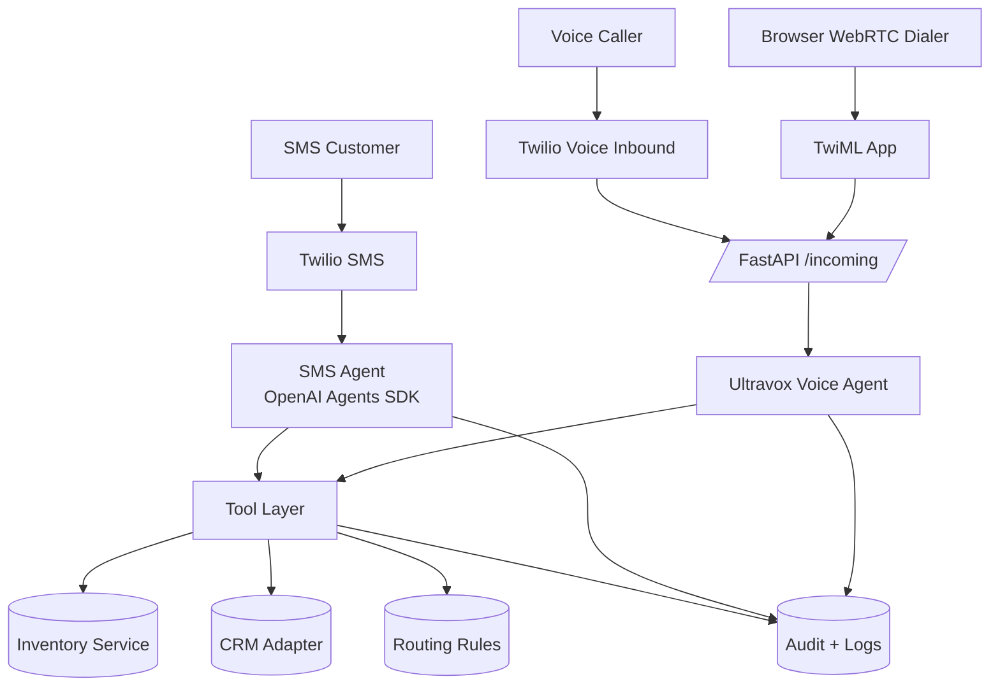

# DealSmart AI Multi-Channel Qualification MVP

## System Overview
- Channels: SMS and Voice now; Email later.
- Agents per channel:
  - Voice: Ultravox agent via Twilio inbound or WebRTC dialer.
  - SMS: OpenAI Agents SDK agent.
- Shared core: qualification schema, tools (inventory/CRM/routing), guardrails.

## Components
1. Channel Adapters
   - SMS Adapter: receives text, runs SMS agent, returns response.
   - Voice Adapter: Twilio inbound webhook creates Ultravox call and streams audio.
   - WebRTC Adapter: TwiML App routes browser calls into the same Ultravox runtime.

2. Shared Orchestrator
   - Maintains conversation state and slot capture.
   - Applies routing rules and escalation logic.

3. Tools Layer
   - Inventory lookup (read-only)
   - CRM create/update lead (write)
   - Routing rules (queue selection)
   - Compliance utilities (TCPA/opt-out)

4. Data + Storage
   - Session transcript (per channel)
   - Structured lead payload
   - Tool call audit trail

## Shared Qualification Schema
- intent: sales | service | trade_in | nurture
- timeline: asap | 1-3 months | 3-6 months | later
- budget: max or range
- trade_in: yes/no + vehicle details
- vehicle_interest: make/model/year/trim
- contact_preference: sms | phone | email

## Guardrails & Compliance
- No hallucinated pricing/inventory: only show data from inventory tool.
- TCPA: store opt-in source/timestamp and handle STOP/opt-out.
- Escalation: low confidence, policy questions, or tool failures.

## Customization Framework (Scale to 500 Dealerships)
Configurable per dealer:
- Tone/persona
- Qualifying questions
- Routing rules
- Business hours and escalation thresholds
- CRM provider + field mappings

Core logic (shared):
- Intent detection + slot capture
- Tool contracts
- Compliance and escalation

## Interoperability Plan
- CRM adapter interface: add GHL, DealerSocket, Salesforce adapters without changing agent logic.
- Inventory service: read-only wrapper.
- Fallback: if inventory/CRM fails, offer human handoff and queue a task.

## Ultravox Inbound Flow
1. Twilio inbound webhook hits `/incoming`.
2. Server creates Ultravox call and receives `joinUrl`.
3. Twilio connects `<Stream>` to `joinUrl`.
4. Ultravox agent runs with tools during the call.

## WebRTC Flow
1. Browser requests `/token` and gets Twilio Client token.
2. Twilio Client calls TwiML App (`/twiml`).
3. `/twiml` creates Ultravox call and returns `<Stream>` to joinUrl.
4. Ultravox agent runs with tools during the call.
