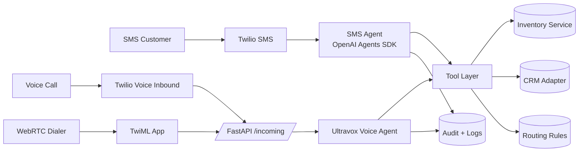

# DealSmart AI Demo

## What This Is
A multi-channel qualification MVP with:
- SMS agent (OpenAI Agents SDK)
- Voice inbound agent (Ultravox + Twilio)
- Shared tools + dealer config

## Architecture (At a Glance)
- Channel adapters: SMS + Voice (WebRTC + Twilio inbound)
- Shared tools: inventory, CRM create/update, routing
- Dealer config: tone, questions, routing, compliance
- Observability: voice logs + summaries + tool call audit



## Setup
1. Install dependencies:
   ```bash
   pip install -r requirements.txt
   ```
2. Install frontend dependencies:
   ```bash
   cd frontend
   npm install
   npm run build
   ```
2. Create `.env`:
   ```bash
   OPENAI_API_KEY=...
   ULTRAVOX_API_KEY=...
   ULTRAVOX_BASE_URL=https://api.ultravox.ai/api
   DEFAULT_DEALER_ID=demo_bmw
   PUBLIC_BASE_URL=https://<your-service-host>
   PUBLIC_API_URL=https://<your-service-host>/api
   API_BASE_PATH=/api
   TWILIO_ACCOUNT_SID=...
   TWILIO_AUTH_TOKEN=...
   TWILIO_FROM_NUMBER=+1XXXXXXXXXX
   TWILIO_API_KEY_SID=...
   TWILIO_API_KEY_SECRET=...
   TWILIO_APP_SID=...
   ```
3. Run the webhook server:
   ```bash
   uvicorn server:app --reload --port 8000
   ```
4. Run the Streamlit app:
   ```bash
   streamlit run app.py
   ```

## Single-Service Deploy (Railway)
This repo ships a `Dockerfile` for **single-service Railway deploy**:
- FastAPI (webhooks + WebRTC + tools)
- Streamlit UI
- Nginx reverse proxy

Railway will automatically use the Dockerfile. No extra start command is needed.

The service exposes:
- UI: `/`
- API: `/api/*`
- WebRTC dialer: `/webrtc/`

Required env vars:
```
PUBLIC_BASE_URL=https://<your-service-host>
PUBLIC_API_URL=https://<your-service-host>/api
API_BASE_PATH=/api
```

## Twilio + Ultravox (Inbound)
- Point your Twilio Voice webhook to `https://<your-service-host>/api/incoming` (POST).
- The server creates an Ultravox call and returns TwiML to stream audio.

## In-App WebRTC (Twilio Client)
1. Create a TwiML App in Twilio Console.
2. Set its **Voice URL** to `https://<your-service-host>/api/twiml` (POST).
3. Put the App SID in `TWILIO_APP_SID`.
4. Add `TWILIO_API_KEY_SID` + `TWILIO_API_KEY_SECRET` in `.env`.
5. Build the frontend (`npm run build`).
6. Open `https://<your-service-host>/webrtc/` to use the dialer.

## Observability
- Voice logs: `data/voice_logs.jsonl`
- Mock CRM: `data/mock_crm.jsonl`
## Dealer Config
See `data/dealer_configs/demo_bmw.json`. Add more dealership configs to scale.

## CRM Adapter
See `core/crm.py`. Implement new adapters without changing agent logic.
